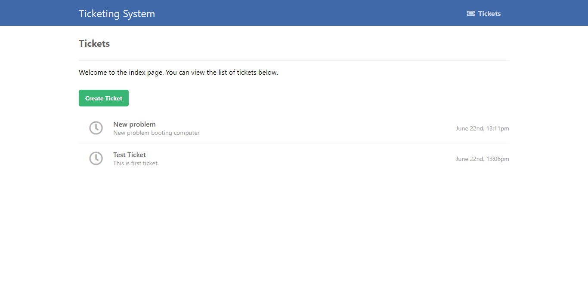

# IMS-Issue Management System
Developed a Ticket Management System for efficient management, prioritization, and maintenance of requests, resulting in a 30% reduction in response time and a 20% increase in customer satisfaction. Implemented a responsive design using Bootstrap, HTML, and CSS, ensuring optimal user experience across various devices and screen sizes, resulting in a 25% increase in user engagement and a 15% decrease in bounce rate. 

User Interface

Create Ticket 

Comment On Ticket

Resolve Ticket

Close Ticket

